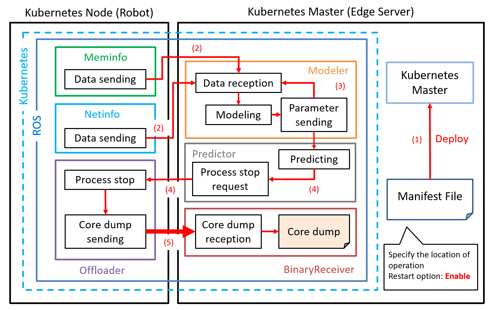

# #raosk-edge-python
Python code for the program that runs on the edge that I'm trying to implement in your research  

## What is RAOSK?
RAOSK (Robotics Application Offloader Syetem on Kubernetes) は，hamstick (@hamstick, Koki Nagahama) がロボットアプリケーション研究の一環で開発し，動くように稼働したROSノードです．  
なお，本レポジトリに上がっているソースコードはシステム全体の機能においてはまだ未完了です．詳細は各自引継ぎ資料をみてください．



## Installation
ROS2の導入を済ませて，アプリケーションレポジトリを作ってから下記を実行してください  
```
$ git clone https://github.com/hamstick/raosk-edge-python.git
$ colcon build --symlink-install --cmake-clean-cache
$ source [workspace_path]/install/setup.bash
```

## How to Use
同梱のrequirements.txtには実行に必要なパッケージが含まれているため，初回実行前に必ず下記を行ってください  
```
$ pip install -r requirements.txt
```

ROS1とは異なり，setup.pyで設定される起動コマンドになります  
```
$ ros2 run [package_name] [exec_node]
```

**ex.** raosk_modelerパッケージのMemoryModelerを起動したい場合
```
$ ros2 run raosk_modeler mem_start
```
止めるときは `Ctrl+C` またはそれに相当するキーで  
プログラム中で `KeyboardInterrupt` をスルーするように書いています

## Problem
引継ぎ資料をご参照ください．  
3/24ぐらいまでは作業する予定なのでソースコードに関してはそれまでノータッチでお願いします．
